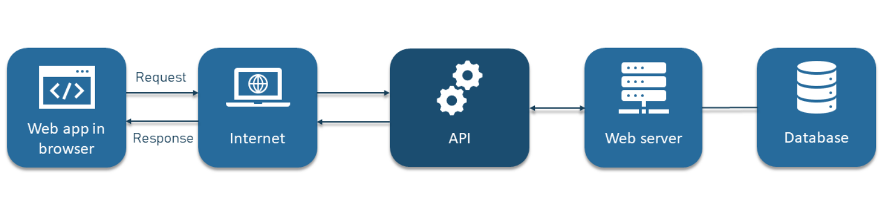
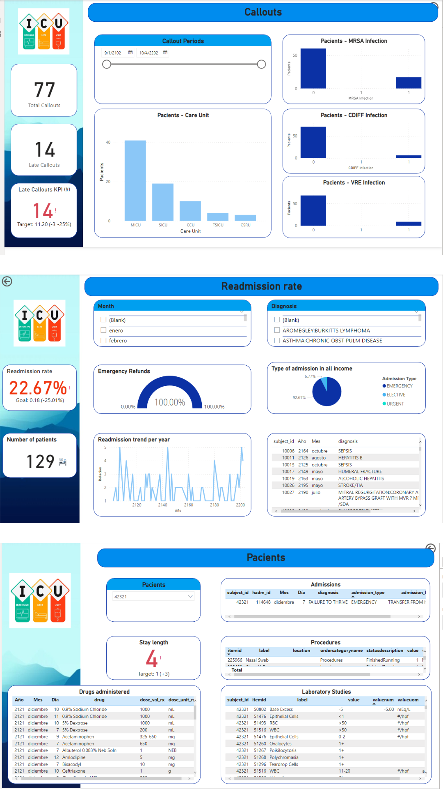

# Proyecto Final - Unidad De Cuidados Intensivos

<center>
  
 </center>


## Contexto

La Unidad de Cuidados Intensivos (`UCI`) de un hospital cuenta con grandes volumenes de información de los pacientes que son atendidos en esta área en una infraestructura vulnerable, con mecanismos de seguridad e integridad débiles, dificultades de escalabilidad y limitada disponibilidad en tiempo real.


## Solución propuesta

La siguiente propuesta establece una arquitectura tecnólogica para el tratamiento de datos, robusta y escalable para soportar y apoyar la toma de decisiones del equipo médico directivo y operativo en el entorno de la recepción, registro, procesos y procedimientos realizados a pacientes que ingresan en la `UCI` de un hospital.


## Objetivos :dart:

El alcance considerado en esta primera etapa de la propuesta es proveer de herramientas que ayuden a: 

- Reducir el tiempo de estancia de los pacientes en la `UCI` mediante una mejor atención.
- Mejorar la selección de los pacientes que ingresan en la `UCI`, mediante la  priorización de su ingreso.
- Reducir la tasa de mortalidad, las tasas de infección e incrementar la satisfacción del paciente.


## Stack Tecnológico :hammer_and_wrench:

- **Python:** Lenguaje de programación de alto nivel y orientado a objetos.
- **Pandas:** Biblioteca de software para el análisis y manipulación de datos estructurados y de series temporales.
- **FastAPI:** Framework de Python para construir APIs web de alta velocidad y alto rendimiento.
- **Jupyter Notebooks:** Aplicación web para crear y compartir documentos que contienen código, visualizaciones y texto explicativo.
- **Visual Studio Code:** Editor de código fuente desarrollado por Microsoft.
- **MySQL:** Sistema de gestión de bases de datos relacional de código abierto.
- **AWS:** Plataforma de servicios de computación en la nube.
- **PowerBI:** Herramienta de análisis y visualización de datos de Microsoft.
- **Trello:** Herramienta de gestión de proyectos y tareas.
- **Google Meet:** Plataforma de videoconferencias de Google.
- **GitHub:** Plataforma de alojamiento y gestión de repositorios de código fuente.


## Metodología de trabajo :pencil2:

**Kanban (Trello)** 

Kanban es una metodología de gestión de flujos de trabajo continuos que se utiliza para visualizar y controlar el trabajo de manera efectiva. Trello es una herramienta de Kanban popular que permite crear tableros personalizados para organizar y monitorear tareas y proyectos. Con esta metodología, los equipos pueden identificar cuellos de botella y reasignar tareas para mejorar la eficiencia y la productividad en un flujo de trabajo continuo y dinámico.


## EDA - ETL :gear:

<center>
  
 </center>

El análisis de datos exploratorio de los diversos conjuntos de datos en la base de datos MIMIC III se hizo en conjunto con el proceso de  Extracción, transformación y carga (ETL). 


Para esta parte, se tomo  varios pasos para analizar la información básica del conjunto de datos y aplicó varios métodos para el preprocesamiento de datos.

Estos varios pasos incluyen:
- Leer todas las tablas de la base de datos en un dataframe correspondiente. 
- Visualizamos la informacion de los dataframes.
- Columnas Vacias: En principio se eliminó las columnas que tenian mas del 80% de registros nulos.
- Despues se analiza de manera exhaustiva si las columnas que tienen aun una mayoria de datos nulos lo usaremos o no para poder eliminarlos. 
- Reemplazar los valores nulos por ceros.


## Alcance


### API :rocket:

<center>
  
 </center>
 
Se implementa una interfase aplicativa abierta `API` para exponer servicios de consulta que pueden ser consumidos por la propia solución y cualquier otra que se autorice.

URL: https://deta.space/discovery/r/ebjhw9xdtu48wjr7 :link:

#### Get average discharge time

```http
  GET /galt/?{year}&{month}
```
Obtiene el tiempo promedio de permanencia de los pacientes con alta en la UCI por mes.

| Parameter | Type     | Description                |
| :-------- | :------- | :------------------------- |
| `year`    | `integer`| **Requerido**. Año a consultar {2100 - 2203} |
| `month`   | `integer`| **Requerido**. Mes a consultar {1 - 12} |

#### Get average death time

```http
  GET /gadt/?{year}&{month}
```
Obtiene el tiempo promedio de permanencia de los pacientes fallecidos en la UCI por mes.

| Parameter | Type     | Description                |
| :-------- | :------- | :------------------------- |
| `year`    | `integer`| **Requerido**. Año a consultar {2100 - 2203} |
| `month`   | `integer`| **Requerido**. Mes a consultar {1 - 12} |

#### Get rate death

```http
  GET /grdt/?{year}
```
Obtiene la tasa de mortalidad por año. 

| Parameter | Type     | Description                |
| :-------- | :------- | :------------------------- |
| `year`    | `integer`| **Requerido**. Año a consultar {2100 - 2203} |

#### Get rate readmmited  `** fuera de alcance en esta etapa`

```http
  GET /grad/?{year}&{month}
```
Obtener la tasa de reingresos a la UCI por mes.

| Parameter | Type     | Description                |
| :-------- | :------- | :------------------------- |
| `year`    | `integer`| **Requerido**. Año a consultar {2100 - 2203} |
| `month`   | `integer`| **Requerido**. Mes a consultar {1 - 12} |


### KPI’s :bar_chart:

- Uno de nuestros objetivos principales es mejorar la eficiencia en la unidad de cuidados intensivos. Para ello, nos enfocaremos en reducir el tiempo de permanencia de los pacientes en un 20% mensual en promedio, lo que permitirá optimizar el uso de los recursos y mejorar la calidad de atención.

- Además, buscaremos reducir la tasa de reingreso a UCI en un 20% mensual, lo que contribuirá a disminuir la carga de trabajo en el personal y a mejorar la recuperación de los pacientes.

- La tasa de IAAS también será una de las métricas que seguiremos de cerca, ya que nos permitirá evaluar la efectividad de las medidas preventivas y detectar   oportunidades de mejora para reducir la tasa de infección asociada a la salud.

- Finalmente, aunque reducir la tasa de infección y la tasa de mortalidad son objetivos importantes, en esta etapa nos enfocaremos en los objetivos mencionados anteriormente, que son más factibles de lograr en el corto plazo. `** fuera de alcance en esta etapa`


### Dashboard :chart_with_upwards_trend:

Se busca presentar información relevante para la toma de decisiones en la UCI a través de métricas y KPIs. Estas incluyen estadísticas generales, como el número de pacientes, admisiones, duración promedio de estadía, tasa de mortalidad, así como datos de pacientes, como edad, género, diagnóstico, comorbilidades, tratamientos, medicamentos, resultados de laboratorio e imágenes médicas.

Además, se muestran tendencias a lo largo del tiempo para diferentes métricas, como la tasa de admisiones, duración de la estadía, tasa de mortalidad y uso de     diferentes tratamientos. Se realizan análisis de subconjuntos de pacientes según diferentes criterios, como edad, género y diagnóstico. Se presenta también un análisis de supervivencia con curvas de supervivencia para diferentes grupos de pacientes.

Se utilizan visualizaciones de redes para mostrar las relaciones entre diferentes diagnósticos, comorbilidades y tratamientos. Finalmente, se explora en detalle los   datos de MIMIC III mediante filtros y gráficos interactivos. Todo esto con el objetivo de apoyar las decisiones de atención y mejora de servicios en la UCI.

<center>
  
 </center>


## Automatización :robot:

Empleamos la plataforma `Apache-Airflow` para automatizar el flujo de procesos de adquisición, exploración, preprocesamiento, transformación y carga de datos al repositorio de MySQL desplegado en AWS-RDS.

En esta primera etapa este flujo inicia en el subsitema Linux de Windows local `WSL`, accediendo a los archivos `csv` desde una carpeta compartida y se ejecutan los procesos `dag` que toman estos archivos, hacen la conexión con MySQL y ejecutan la carga de datos.

Este flujo de procesos se escalará en siguientes etapas para que los archivos se alojen en el subsistema S3 de AWS para robustecer el proceso de cargas incrementales.


## Modelo de Machine Learning


## Autores :busts_in_silhouette:
:yellow_circle: **Carlos Farias** :yellow_circle:
- GitHub: [@CarlitosAlex](https://github.com/CarlitosAlex)
- Correo electronico: cfarias.gallardo7@gmail.com
- Linkedin: https://www.linkedin.com/in/carlos-farias-33796b82/

:yellow_circle: **Carlos Vargas** :yellow_circle:
- GitHub: [@Cvargas24](https://github.com/Cvargas24)
- Correo electronico: cfarias.gallardo7@gmail.com
- Linkedin:

:yellow_circle: **Jose Manuel Bracho** :yellow_circle:
- GitHub: [@jbracho03](https://github.com/jbracho03)
- Correo electronico: josemanuelbrachonavarro@gmail.com
- Linkedin: www.linkedin.com/in/jose-manuel-bracho-navarro

:yellow_circle: **Ramon Acevedo** :yellow_circle:
- GitHub: [@racevedog](https://www.github.com/racevedog)
- Correo electronico: racevedog7@gmail.com
- Linkedin:

## Github

https://github.com/Grupo-9-UCI/Proyecto_Final

